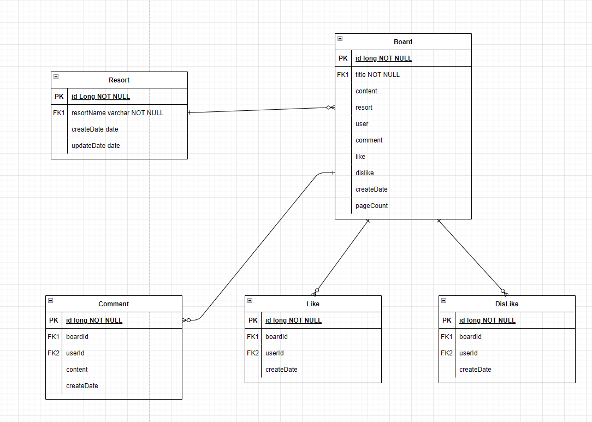

## 같이타요 - 스키/보드 플랫폼 사이드 프로젝트입니다.

- 제가 구현한 부분은 User, Board, Carpool 부분입니다.
- 또한 배포를 담당하였습니다.

### 1. 기술 스택
- 공통
  - Spring Boot 2.7.5
  - Lombok
  - Java 11
  
- Spring Web Module
  - Spring Web
  - MariaDB
  - OAuth2
  - Spring Security
  - JWT

- Spring Webflux Module
  - Spring Webflux
  - Reactive MongoDB

> 
> - 시스템 아키텍쳐 입니다.

### 2. Spring - Web (ski-backend)

- 전체 erd입니다.


--- 

#### (1) User
- Spring Security + Jwt(auth00) + OAuth2 조합으로 사용자 인증을 구현하였습니다.

> 
> - Oauth 로그인 시 시퀀스 다이어그램입니다.

> 
> - 유저부분만 간단히 추려놓은 erd입니다.


#### API 서버 내의 인증 절차
1) JWT 발급
- 먼저 CorsFilter에서 저희가 허용한 Origin인지 점검합니다.
- 후에 JwtAuthenticationFilter의 attemptAuthentication 메소드가 인증을 진행합니다.
- 인증이 적합하면 JWT를 발급해 줍니다.

2) JWT 인증
- 권한이나 인증이 필요한 메소드를 호출되면 JwtAuthoriztionFilter가 중간에 개입합니다.
- 들어온 jwt를 디코딩하고, 해당 jwt에 있는 username이 null인지 확인합니다.
- username != null 이면, 해당 유저는 사전에 적합한 인증절차를 거친 후에 jwt를 발급 받은 유저이므로, 
- 해당 username으로 userEntity를 찾아 SecurityContextHolder에 강제적으로 해당 유저를 주입합니다.

3) CrossOrigin
- 브라우저는 기본적으로 CrossOrgin을 할 때 Preflight를 전송합니다.(일종의 노크) 
- WebMvcConfig에서 Preflight 결과를 캐시로 저장하여(3600초 동안) preflight를 생략하고 바로 요청을 전송할 수 있습니다.
```java
@Configuration
@EnableWebMvc
public class WebMvcConfig implements WebMvcConfigurer {

    @Override
    public void addCorsMappings(CorsRegistry registry) {
        registry.addMapping("/**")
                .allowedOrigins("http://15.165.81.194:3000")
                .allowCredentials(true)
                .allowedMethods("*")
                .allowedHeaders("*")
                .maxAge(3600);
    }
```


---
#### (2) Board
> 
> - Board의 간략한 ERD입니다.


- 기본적인 게시판 비즈니스 로직으로 제목과 내용으로 이루어져있습니다.
- 좋아요와 싫어요를 누를 수 있고, 좋아요 싫어요 합계 수가 많은 게시글을 추천글로 제공하는 API를 구현했습니다.
- 추천글 API의 경우 아래와 같이 Native Query로 작성하였습니다.
  - ```java
        @Query(value = "SELECT b.* FROM board b INNER JOIN (SELECT boardId, COUNT(boardId) likeCount FROM likes GROUP BY boardId) c ON b.id = c.boardId ORDER BY likeCount DESC", nativeQuery = true)
        List<Board> getPopular();
    ```
  - 좋아요의 경우에는 로그인한 사용자가 게시글을 조회할 때 좋아요 상태와 수를 체크하도록 구현 하였습니다.
    - ```java
          // 좋아요와 싫어요 상태를 반영하는 메소드
           public void loadLikesAndDislikes(long principalId) {

              long likeCount = this.getLikes().size();
              long dislikeCount = this.getDislikes().size();
      
              this.setLikeCount(likeCount);
              this.setDislikeCount(dislikeCount);
              this.setTotalLikeCount(likeCount - dislikeCount);
      
              this.getLikes().forEach((like) -> {
                  if (like.getUser().getId() == principalId) {
                      this.setLikeState(true);
                  }
              });
      
              this.getDislikes().forEach(dislikes -> {
                  if (dislikes.getUser().getId() == principalId) {
                      this.setDislikeState(true);
                  }
              });
          }
      ```
      
---  
#### (3) Carpool

> 
> - Carpool 부분만 간단히 추려놓은 ERD입니다.

- Carpool 역시 게시판 기반의 Entity입니다.
- 다른 점은 협상 가능한 부분을 구현해달라는 요구사항이 있었습니다. 예를 들어 출발시간의 경우 협상이 가능한지 체크하는 기능이 그것입니다.
- 이 부분을 Negotiate라는 Entity를 만들어서 해결하였습니다.
- 카풀을 신청하면 Submit Entity가 저장이 되고, Submit Entity의 state가 default value = 0 으로 저장됩니다.
- 승인을 하면 state = admit으로 되고 완료됩니다.
- 그리고 카풀의 경우 신청자와 글 작성자 간의 채팅 기능이 제공되는데, Whisper Entity가 그 교두보 역할을 합니다.

---
## 4. 배포
- 배포의 경우 제가 이번에 한 경험들을 블로그에 작성하였습니다.

#### (1) github action
- 처음 배포 시나리오는 github action - aws elasticbeanstalk을 이용한 CI/CD 였습니다.
- 하지만 Docker를 사용하지 않고 하나의 어플리케이션 플랫폼을 java로 만들시 node기반 어플리케이션을 함께 실행시키는데 어려움이 있었습니다.
- 해서 ec2에 수동으로 배포하는 전략을 채택했습니다.
- 수동으로 배포하는데 손이 너무 많이 가서 배포 스크립트를 작성하였습니다.

#### (2) 수동배포
- git clone ~ 프로그램 실행까지 원스톱 스크립트를 작성했습니다.
- 그러나 build과정에서 cpu 자원을 너무 많이 소모하여 ec2의 cpu 크레딧을 모두 소모하여 멈춰버리는 현상이 발생했습니다.
- 하여 로컬에서 빌드를 자동으로 하는 스크립트를 작성하고,
- 빌드가 된파일을 sftp로 옮긴 후 실행시키는 방식으로 전환하였습니다.
- 서버를 재시작하는 과정 역시 번거로워서 이것도 스크립트로 만들었습니다.

> ```shell
> # 1. Stop web-module
> echo "1. stop web-module"
> BACKEND_PID=${pgrep -f ski-0.0.1-SNAPSHOT.jar}
> kill -9 $BACKEND_PID
>
> # 2. run web-module
> echo "2. run web-module"
> cd ~/application
> chmod u+x ski-0.0.1-SNAPSHOT.jar
> nohup java -jar ski-0.0.1-SNAPSHOT.jar 1>>backend-std.out 2>>backend-err.out &
> ```
> pgrep 으로 서버 구동 PID를 찾고 종료시킨 후, 다시 서버를 시작시키는 스크립트입니다.
